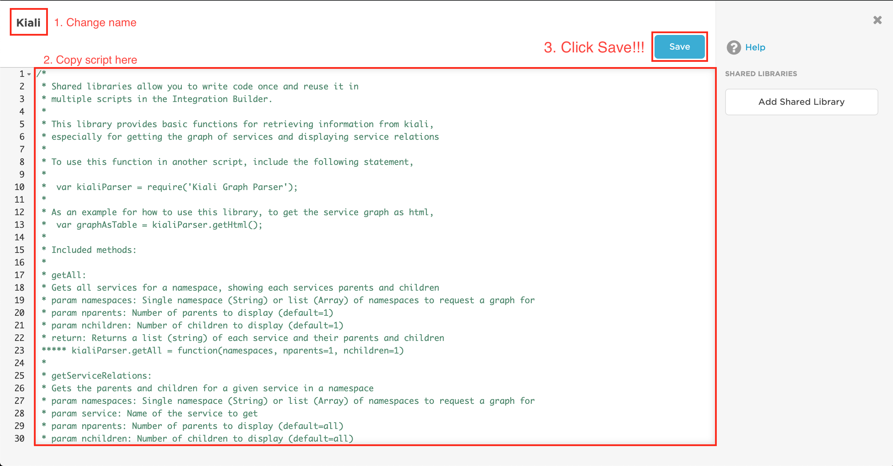
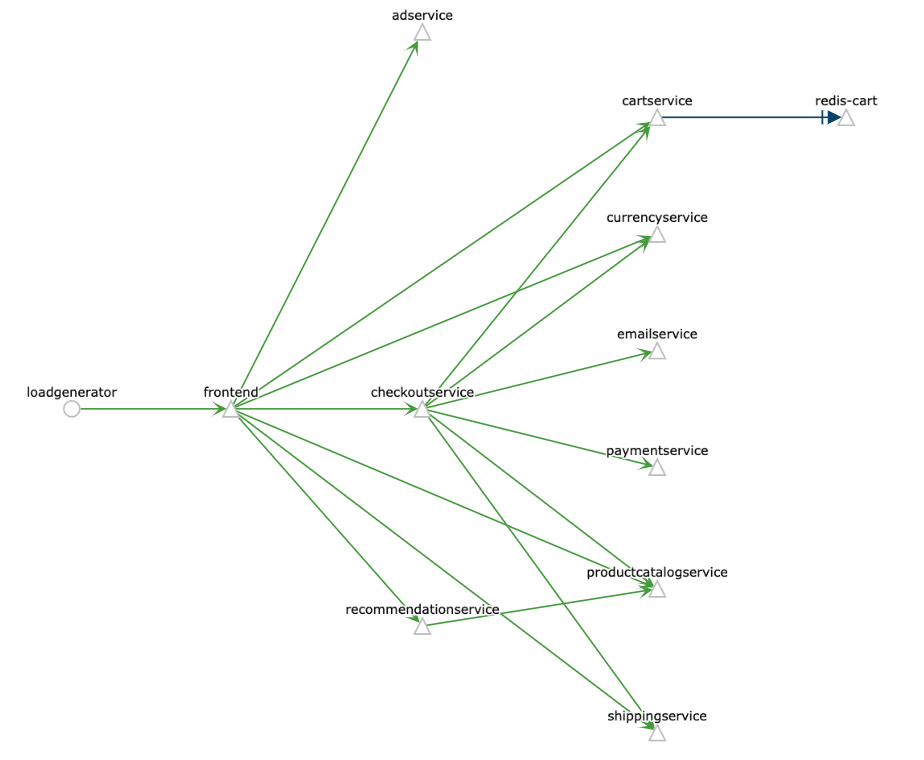
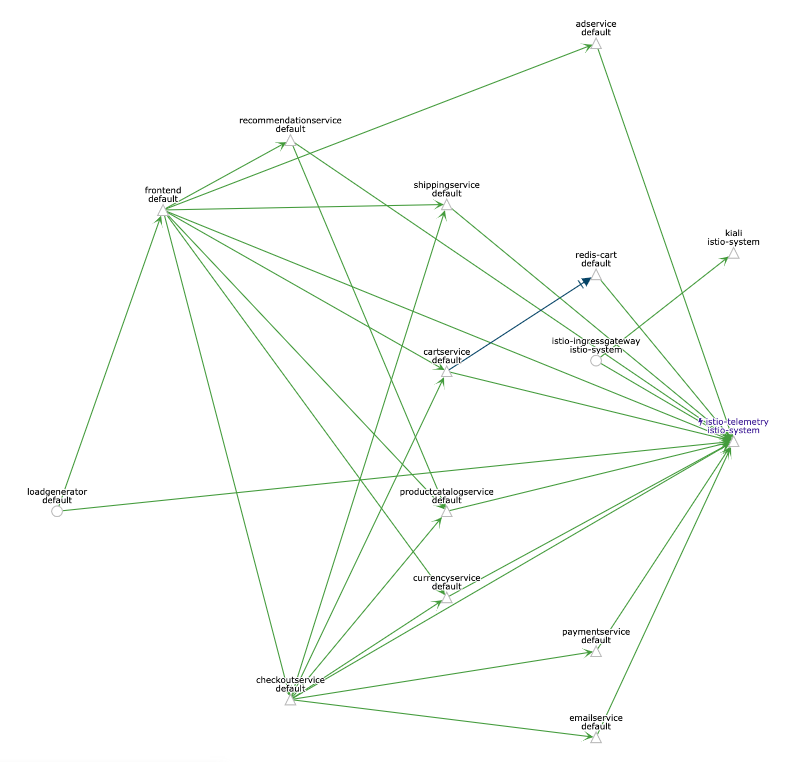
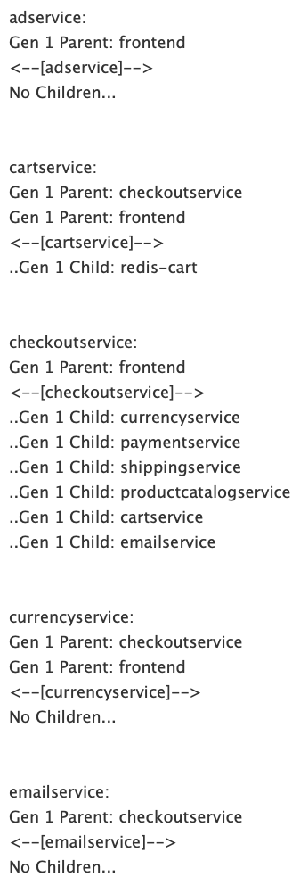
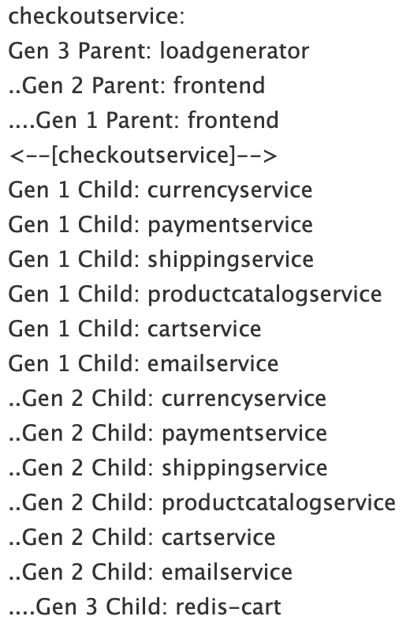
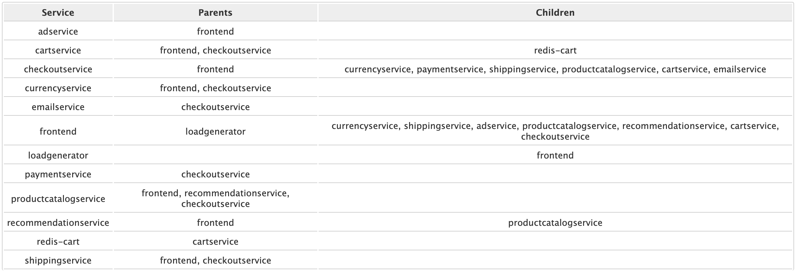

# Istio - Kiali <--> xMatters integration
This is part of the xMatters Labs awesome listing. For others, see [here](https://github.com/xmatters/xMatters-Labs)
With this library, notification recipients can quickly see how the microservices of their application are related in order to more efficiently fix errors.

This document details how to install and use this integration. 

---------

<kbd>

</kbd>

---------
# Pre-Requisites
* An application deployed in kubernetes broken up into microservices (via docker); see [here](https://istio.io/docs/examples/bookinfo/) for a basic example
* A communication plan, and access to names of microservices from a script - could be applicable to a stackdriver integration, adding the service name into the xmatters inbound, then getting the service's relations when notifying someone
* xMatters account - If you don't have one, [get one](https://www.xmatters.com)! 

# Files
* [kiali.js](./kiali.js) - This is the Kiali library you can use to retrieve information from Kiali
* [inbound.js](./inbound.js) - This is an example inbound script that shows you how to call each method from the kiali library

# Introduction - How it works
Kiali is an addon to install with Istio, that works in conjunction with the Istio service mesh to cleanly display a graph of how your services are related. The Kiali library is meant to extend Kiali's functionality to xMatters, to allow xMatters users to quickly understand how certain services in their application are related to each other. This can be especially useful when certain services break or have a high rate of error, and developer would like to see how the service breaking may affect other parts of their application. When using other xMatters integrations to monitoring applications (for example: stackdrive), the Kiali library may be useful in pointing developers in the right direction towards fixing the problem. 
Kiali displays a graph of your microservices, with each service being a "Node", and each relation between services is an "Edge". Two services are related if they communicate with each other and have network traffic between them (e.g. via rest call). In this library, we have chosen to show relationships as either "Parent" relationships or "Children" relationships, where parents are where traffic originates (the source), and children are where traffic is directed (the target). Often times, when a service breaks or shows a high frequency of error, it may actually be due an error with the parent, and Kiali helps visualize this tendency in order to make debugging less confusing.

# Installation
## Prerequisites:
1. Must have [kubectl](https://kubernetes.io/docs/tasks/tools/install-kubectl/) and [gcloud](https://cloud.google.com/sdk/install) command line tools, 
2. A microserviced application deployed in kubernetes with Istio installed, for instructions on downloading and installing Istio, see [Downloading Istio](https://istio.io/docs/setup/kubernetes/download/) and [Customizable Install with Helm](https://istio.io/docs/setup/kubernetes/install/helm/)

## Enabling Kiali in Istio
Note: Istio has an updated guide on how to install Kiali [here](https://istio.io/docs/tasks/telemetry/kiali/), the steps are listed here for your convenience but for the most updated steps, use that link

1. In the unix-based terminal, run the following commands to create a kiali username and password:
```
NAMESPACE=istio-system
```
```
KIALI_USERNAME=$(read -p 'Kiali Username: ' uval && echo -n $uval | base64)
```
```
KIALI_PASSPHRASE=$(read -sp 'Kiali Passphrase: ' pval && echo -n $pval | base64)
```
Note: if you use a different namespace for your istio installation, change istio-system to whatever you use

2. Create a Kiali secret by running the following command:
```
cat <<EOF | kubectl apply -f -
apiVersion: v1
kind: Secret
metadata:
  name: kiali
  namespace: $NAMESPACE
  labels:
    app: kiali
type: Opaque
data:
  username: $KIALI_USERNAME
  passphrase: $KIALI_PASSPHRASE
EOF
```
3. Using the helm template you used to install Istio, add `--set kiali.enabled=true` as an option to the helm command, for example:
```
helm template install/kubernetes/helm/istio --set kiali.enabled=true --name istio --namespace istio-system > $HOME/istio.yaml
kubectl apply -f $HOME/istio.yaml
```
4. Redeploy your application, 
5. Run the following command to expose the Kiali endpoint to external traffic:
```
cat <<EOF | kubectl apply -f -
apiVersion: networking.istio.io/v1alpha3
kind: Gateway
metadata:
  name: kiali-gateway
  namespace: istio-system
spec:
  selector:
    istio: ingressgateway
  servers:
  - port:
      number: 15029
      name: http-kiali
      protocol: HTTP
    hosts:
    - "*"
---
apiVersion: networking.istio.io/v1alpha3
kind: VirtualService
metadata:
  name: kiali-vs
  namespace: istio-system
spec:
  hosts:
  - "*"
  gateways:
  - kiali-gateway
  http:
  - match:
    - port: 15029
    route:
    - destination:
        host: kiali
        port:
          number: 20001
---
apiVersion: networking.istio.io/v1alpha3
kind: DestinationRule
metadata:
  name: kiali
  namespace: istio-system
spec:
  host: kiali
  trafficPolicy:
    tls:
      mode: DISABLE
---
EOF
```
6. In [GKE](https://console.cloud.google.com/kubernetes/), click the **Services** tab, then you should see **istio-ingressgateway**; copy the endpoint with the `15029` port. 
7. Navigate to `[endpoint]:15029/kiali` in a browser to make sure kiali is working properly (you should see a login screen), input the username and password you defined in the Kiali secret to explore Kiali

- - - -

# xMatters Integration Set-up:
## Prerequisites
1. A Communication Plan in xMatters 
2. An application in kubernetes with Istio installed, and access to service names via inbound or outbound script in xMatters

## Kiali Library Set-up
1. Locate your Communication Plan (xMatters > **DEVELOPER** tab), click **Edit** > **Integration Builder**
2. Next to **Shared Libraries**, click Add
3. Change the name to something descriptive, e.g. `Kiali`
4. Copy [The Script](./kiali.js), then click **Save** the library

5. Click `Edit Endpoints`, then click `Add Endpoint`
6. Give the endpoint a descriptive name (e.g. Kiali), then change the Base URL to be the `:15029` endpoint (without the '/kiali' part). Add the username and password, then click **Save**
7. Click `Edit Constants`, then click `Add Constant`, set the name to **Kiali Endpoint**, using the same URL and port as part (6)
8. Add Kiali methods to other inbound/outbound scripts. See an example of how to call each method below

- - - - 

# Documentation
### Notes
* For methods that allow multiple namespaces, this means that if a service is related to a service in a different namespace, including both those namespaces will show that relationship, if you include only the namespace that one of those services is in, then you will not see that relationship (So you can choose whether or not to include relationships of monitoring applications like those that istio has with your application)
* The service names are the same as you see when doing `kubectl get services -n [namespace]', so the kialis methods will fail if you are attempting to get a service that is not in the namespace you specify
* If istio is not installed or working properly (especially the istio sidecar injector), then you may not get the output you expect to see
### Example Application
* Below you will see examples of output from the Kiali methods, they are taken from [this](https://github.com/GoogleCloudPlatform/microservices-demo) example application, the two graphs below show how the services are related (the first one is just the application, the second one is the application combined with istio)


### getAll
* Gets all services for a namespace, showing each service's parents and children
* params: 
    * namespaces: Single namespace (String) or list of namespaces to request a graph for
    * nparents: Number of parents to display (default=1)
    * nchildren: Number of children to display (default=1)
* return: A list (string) of each service and their parents and children
* calling this method:
```
kiali = require('kiali');
// to get services for a single namespace
kiali.getAll('namespace');
// to get services for multiple namespaces
kiali.getAll(['namespace1', 'namespace2', 'namespace3'], 10, 10);
```
* example output:  


### getServiceRelations
* Gets the parents and children for a given service in a namespace
* params: 
    * namespaces: Single namespace (String) or list of namespaces to request a graph for
    * service: Name of the service to get
    * nparents: Number of parents to display (default=1)
    * nchildren: Number of children to display (default=1)
* return: Returns a string showing all (or nparents & nchildren) the service's parents and children
* calling this method:
```
kiali = require('kiali');
// to get the relations of a service for a single namespace
kiali.getServiceRelations('service', 'namespace');
// to get parents, grandparents, and great-grandparents, as well as children, grandchildren, and great-grandchildren of a service for a single namespace
kiali.getServiceRelations('service', 'namespace', 3, 3);
// to get the relations of a service for multiple namespaces
kiali.getServiceRelations('service', ['namespace1', 'namespace2', 'namespace3']);
```
* example output:  



### getServiceDetails
* Gets the details for the given service, see example output at https://www.kiali.io/api/#operation/serviceDetails
* params: 
    * namespaces: Single namespace in which the service is running
    * service: Name of the service to get
* return: Returns the json of the service details, see [Service Details](https://www.kiali.io/api/#operation/serviceDetails) for explanation of the returned object
* calling this method:
```
kiali = require('kiali');
// to get the details of a service
kiali.getServiceDetails('service', 'namespace');
```
* example output: [see here](https://www.kiali.io/api/#operation/serviceDetails)

### getHtml
* Gets the Kiali graph as an HTML table with a row for each service, with a column containing a list of parent services, and a column containing a list of children services
* params: 
    * namespaces: Single namespace (String) or list (Array) of namespaces to request a graph for
* return: Returns the html (as a String) of all services as a table
* calling this method:
```
kiali = require('kiali');
// to get the html for one namespace
kiali.getHtml('namespace');
// to get the html for multiple namespaces
kiali.getHtml(['namespace1', 'namespace2', 'namespace3'])
```
* example output:  


### getJson
* Gets the JSON representation of a service graph
* params: 
    * namespaces: Single namespace (String) or list (Array) of namespaces to request a graph for
* return: Returns the json (as a JavaScript Object) of the Kiali graph
* calling this method:
```
kiali = require('kiali');
// to get the JSON for one namespace
kiali.getJson('namespace');
// to get the JSON for multiple namespaces
kiali.getJson(['namespace1', 'namespace2', 'namespace3'])
```
* example output: [see here](https://www.kiali.io/api/#operation/graphNamespaces)
### getLink
* Gets the Link to the Kiali graph
* return: The link (as a string) to the Kiali graph
* calling this method:
```
kiali = require('kiali');
// to get the link for the graph of a single namespace
kiali.getLink('namespace');
// to get the link for the graph of multiple namespaces
kiali.getLink(['namespace1', 'namespace2', 'namespace3']);
```
* Note: this link leads you to the graphs shown at the beginning of this documentation
