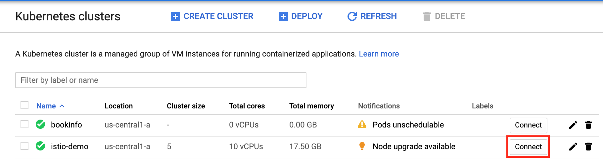

# Istio - Kiali <--> xMatters integration
This is part of the xMatters Labs awesome listing. For others, see [here](https://github.com/xmatters/xMatters-Labs)
With this Outbound Integration, notification recipients can quickly continue a pipeline that requires a user response to do something via Spinnaker

This document details how to install and use this integration. 

---------

<kbd>

</kbd>

---------
# Pre-Requisites
* An application deployed in kubernetes broken up into microservices (via docker); see [here](https://istio.io/docs/examples/bookinfo/) for a basic example
* A communication plan, and access to names of microservices from a script - could be applicable to a stackdriver integration, adding the service name into the xmatters inbound, then getting the service's relations when notifying someone
* xMatters account - If you don't have one, [get one](https://www.xmatters.com)! 

# Files
* [kiali.js](./kiali.js) - This is the Kiali library you can use to retrieve information from Kiali
* [inbound.js](./inbound.js) - This is an example inbound script that shows you how to call each method from the kiali library

# Introduction - How it works
Kiali is an addon to install with Istio application that allows the user to customize a wide range of inputs to result in many different outcomes, depending on what you desire. One thing it is somewhat lacking is a simple way to allow for user input directly from an email or phone, which is where xMatters comes in. In any Spinnaker pipeline, it is very simple to insert a webhook that fires off a notification to xMatters, then continue the pipeline selecting a stage based on user input, and this guide will show you how to set this up, using an example that "Deploy"s to Dev or Test. We will not actually be deploying anything, but it is just one example of what you could do using Spinnaker's stages that run a Jenkins job.

# Installation
## Prerequisites:
1. Must have kubectl and gcloud command line tools
2. A microserviced application deployed in kubernetes

## [Istio Installation](#istio-installation)
1. Download istio onto your local computer by following the steps at [Downloading Istio](https://istio.io/docs/setup/kubernetes/download/)
2. Go to [Google Kubernetes Engine](https://console.cloud.google.com/kubernetes/), and click **Connect** on your Kubernetes cluster

3. Run the given gcloud command either in your local command line or in a Cloud Shell to connect to your cluster in the command line
4. Create the istio-system namespace with `kubectl create namespace istio-system`
5. Enable Istio sidecar auto-injection with `kubectl label namespace [namespace] istio-injection enabled`, replacing `[namespace]` with the namespace(s) your application is installed in
6. Make sure you are in the istio directory for the istio version you just installed in part (1)
7. Install Istio CRDs with `helm template install/kubernetes/helm/istio-init --name istio-init --namespace istio-system | kubectl apply -f -`
8. Run the above command a second time to configure and commit the CRDs
9. Install Istio with `helm template install/kubernetes/helm/istio --name istio --namespace istio-system \
--values install/kubernetes/helm/istio/values-istio-demo.yaml | kubectl apply -f -`. Note for this demo, we are using the given **demo** profile, as it automatically installs Istio with the Kiali, Grafana, and Prometheus add-ons. 
10. In [GKE](https://console.cloud.google.com/kubernetes/), click the **Services** tab, then you should see **istio-ingressgateway**; copy the endpoint with the `15029` port. 
11. Navigate to `[endpoint]:15029/kiali` in a browser to make sure kiali is working properly (you should see a login screen)

- - - -

# xMatters Integration Set-up:
## Prerequisites
1. A Communication Plan in xMatters 
2. A microserviced application, and access to service names via inbound or outbound script in xMatters

## Kiali Library Set-up
1. Locate your Communication Plan (xMatters > **DEVELOPER** tab), click **Edit** > **Integration Builder**
2. Next to **Shared Libraries**, click Add
3. Change the name to something descriptive, e.g. `Kiali`
4. Copy [The Script](./kiali.js), then click **Save** the library
5. Click `Edit Endpoints`, then click `Add Endpoint`
6. Give the endpoint a descriptive name (e.g. Kiali), then change the Base URL to be the `:15029` endpoint (without the '/kiali' part). Add the username and password (default is admin:admin), then click **Save**
7. Add Kiali methods to other inbound/outbound scripts. See an example of how to call the methods at the [Example Inbound Script](./inbound.js)

- - - - 

# Documentation
### getAll
* Gets all services for a namespace, showing each service's parents and children
* params: 
    * namespaces: Single namespace (String) or list of namespaces to request a graph for
    * nparents: Number of parents to display (default=1)
    * nchildren: Number of children to display (default=1)
* return: A list (string) of each service and their parents and children

### getServiceRelations
* Gets the parents and children for a given service in a namespace
* params: 
    * namespaces: Single namespace (String) or list of namespaces to request a graph for
    * service: Name of the service to get
    * nparents: Number of parents to display (default=1)
    * nchildren: Number of children to display (default=1)
* return: Returns a string showing all (or nparents & nchildren) the service's parents and children

### getServiceDetails
* Gets the details for the given service, see example output at https://www.kiali.io/api/#operation/serviceDetails
* params: 
    * namespaces: Single namespace (String) or list of namespaces to request a graph for
    * service: Name of the service to get
* return: Returns the json of the service details, see [Service Details](https://www.kiali.io/api/#operation/serviceDetails) for explanation of the returned object

### getHtml
* Gets the Kiali graph as an HTML table with a row for each service, with a column containing a list of parent services, and a column containing a list of children services
* params: 
    * namespaces: Single namespace (String) or list (Array) of namespaces to request a graph for
* return: Returns the html (as a String) of all services as a table

### getJson
* Gets the JSON representation of a service graph
* params: 
    * namespaces: Single namespace (String) or list (Array) of namespaces to request a graph for
* return: Returns the json (as a JavaScript Object) of the Kiali graph

### getLink
* Gets the Link to the Kiali graph
* return: The link (as a string) to the Kiali graph

